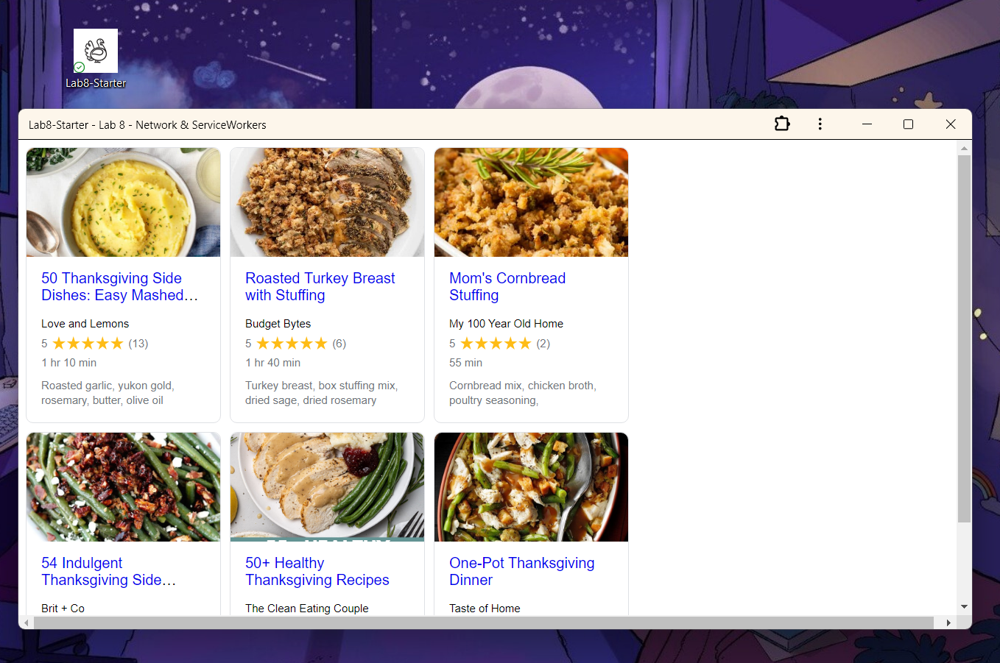

# Lab8-Starter

https://jberdeski.github.io/Lab8-Starter/

**How are graceful degradation and service workers related?**

Graceful defradation and service workers are related by enhancing web application resilience and user experince. Graceful degradation makes sure that a web app works and even when certain parts of it fail or are not supported by the user's browser. While service workers are scripts than run in the background of a web app, enabling features like offline access and push notifications. When used together, the two make for a enjoyable experience despite things like network interruptions or other issues for the user.  

